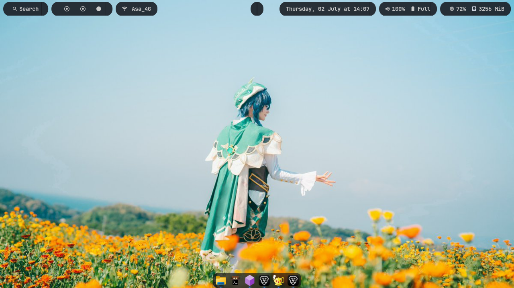
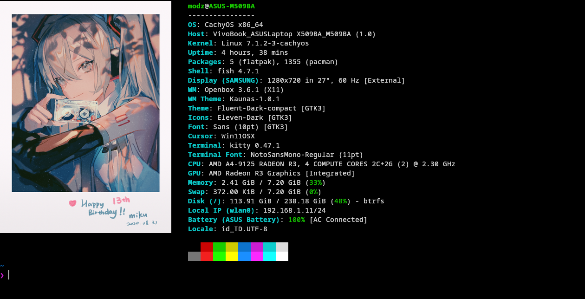
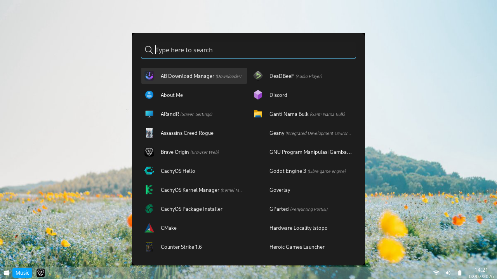
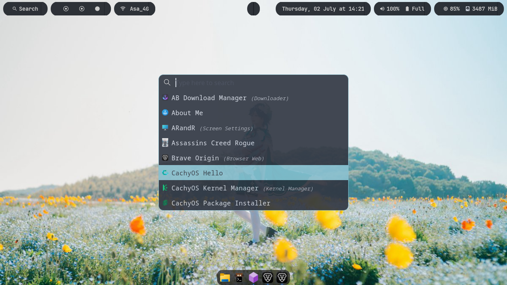
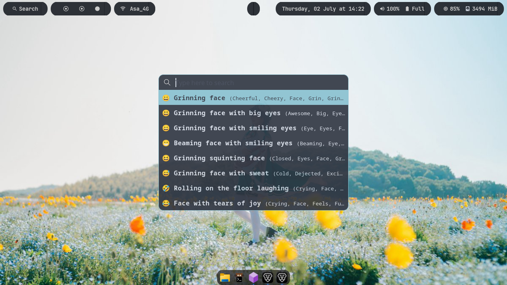
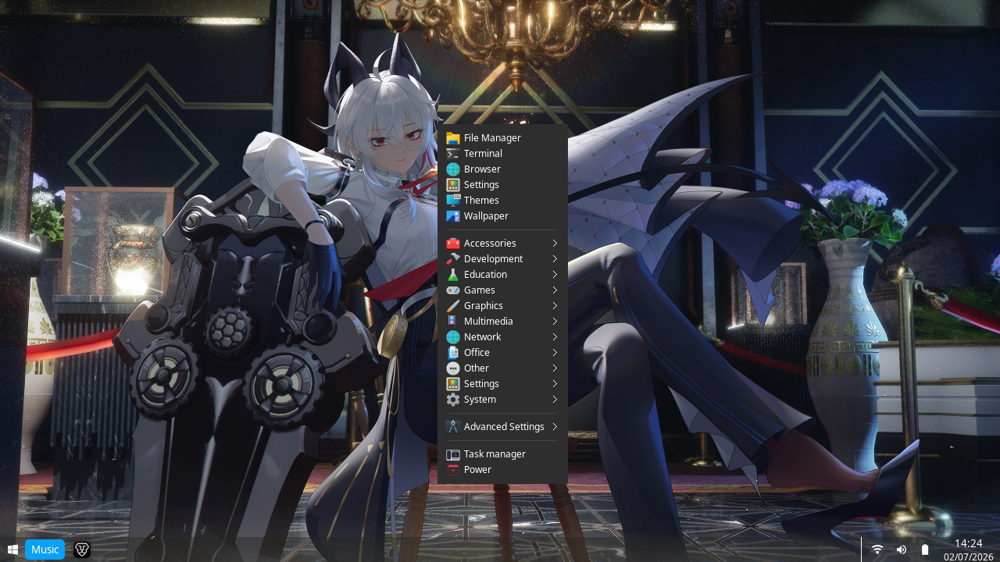
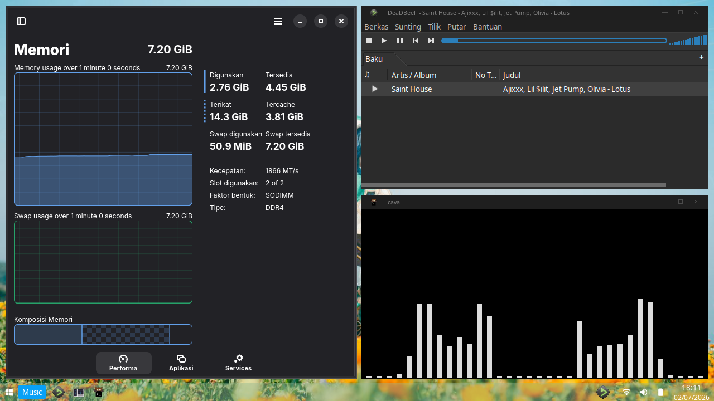
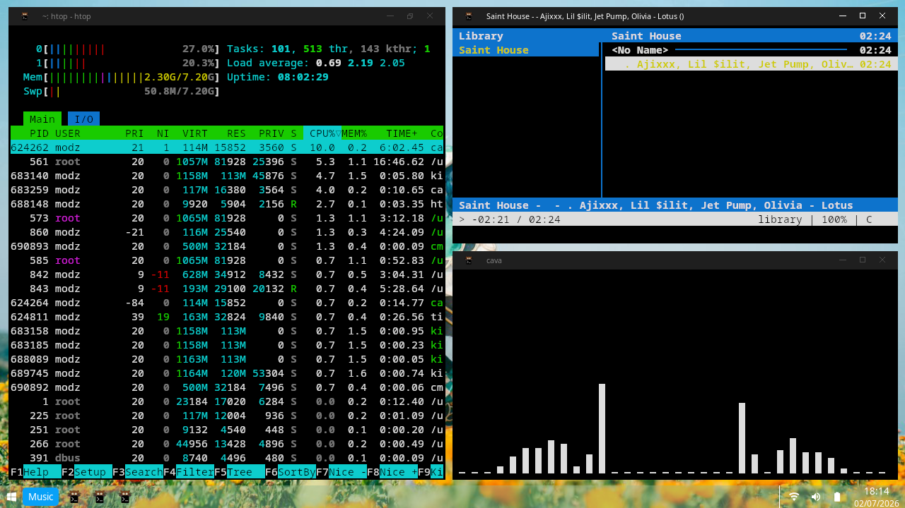
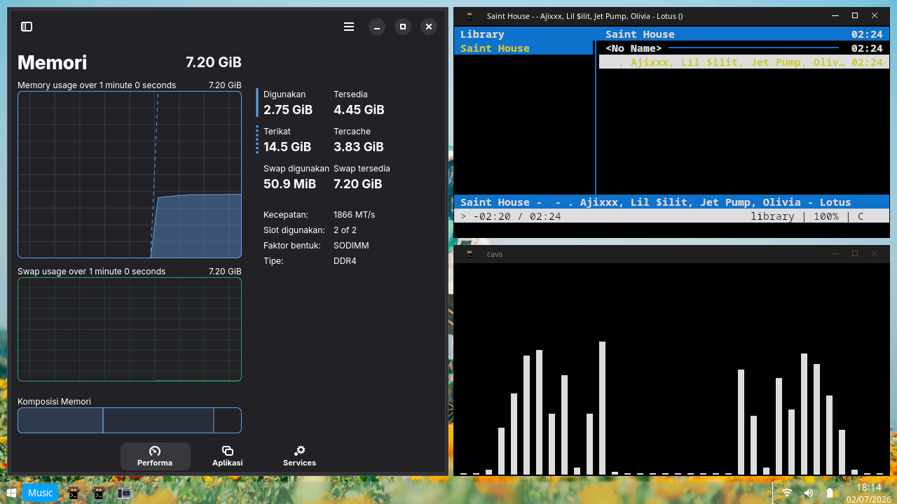
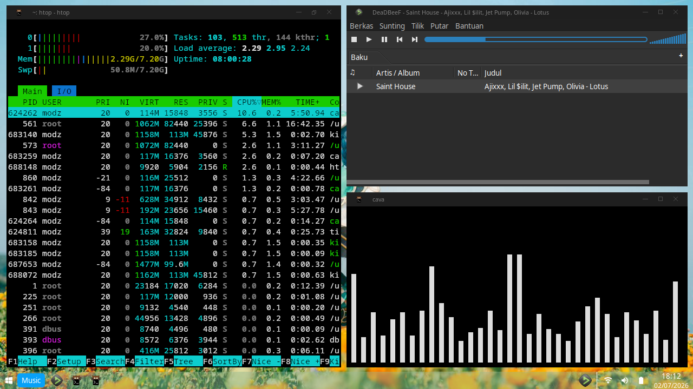

# Wac Dotfiles

<p align="center">

A clean, Windows-inspired Openbox desktop environment for Arch Linux with a switchable macOS-style ricing mode.

</p>

<p align="center">


</p>

> Daily driver by default. Screenshot-ready whenever you feel like pretending you're productive.

---

# Table of Contents

- [Preview](#preview)
- [Fastfetch](#fastfetch)
- [Layout Modes](#layout-modes)
- [Features](#features)
- [Appearance](#appearance)
- [Requirements](#requirements)
- [Dependencies](#dependencies)
- [Installation](#installation)
- [Keybindings](#keybindings)
- [Credits](#credits)
- [License](#license)

---

# Preview

## 🖥️ Normal Mode


## 🎨 Ricing Mode



---

# Fastfetch

> **Kitty terminal is recommended.**

Fastfetch image preview uses the **Kitty Graphics Protocol**. Other terminals may not render images correctly.



---

# Layout Modes

Wac Dotfiles provides **two desktop layouts** that can be switched instantly depending on your workflow.

## 🖥️ Normal Mode

Designed for everyday desktop usage.


### Includes

- Polybar status bar
- Tint2 taskbar
- Plank dock
- Standard application launcher
- Windows-like workflow

---

## 🎨 Ricing Mode

Designed for a minimal and aesthetic desktop.


### Includes

- Minimal desktop layout
- Floating dock
- Minimal launcher
- Ricing widgets
- Better for screenshots

---

## Comparison

| Feature | Normal | Ricing |
|:--------|:------:|:-------:|
| Polybar | ❌ | ✅ |
| Tint2 Taskbar | ✅ | ❌ |
| Plank Dock | ❌ | ✅ |
| Standard Launcher | ✅ | ❌ |
| Minimal Launcher | ❌ | ✅ |
| Ricing Widgets | ✅ | ❌ |
| Productivity | ⭐⭐⭐⭐⭐ | ⭐⭐⭐ |
| Screenshot Friendly | ⭐⭐⭐ | ⭐⭐⭐⭐⭐ |

### Switching Mode

| Shortcut | Action |
|----------|--------|
| <kbd>Shift</kbd> + <kbd>Pause</kbd> | Toggle Normal Mode / Ricing Mode |

---

# Features

## 🖥️ Desktop

- Openbox Window Manager
- Polybar status bar
- Tint2 taskbar
- Plank dock
- Rounded Windows-inspired interface
- Dynamic wallpaper color scheme
- Automatic display profile switching

---

## 🚀 Launcher

### Normal Mode

Traditional application launcher.



---

### Ricing Mode

Minimal launcher optimized for desktop ricing.



---

### Emoji Picker

Available in both modes.



---

## 📋 Context Menu

Right-click anywhere on the desktop to access Openbox's context menu.

Includes quick access to:

- File Manager
- Terminal
- Browser
- Settings
- Themes
- Wallpaper
- Applications
- Mission Center
- Power Menu



---

## 📊 Mission Center

Built-in graphical system monitor.

Features

- CPU Usage
- Memory Usage
- GPU Information
- Disk Usage
- Network Activity
- Process Viewer

Launch via

- Context Menu
- <kbd>Ctrl</kbd> + <kbd>Shift</kbd> + <kbd>Esc</kbd>

---

## 🖥️ Ricing Widgets

Display system information and music playback directly on your desktop.

> [!NOTE]
> Ricing Widgets are designed for **Normal Mode**. They may overlap or look incorrect in **Ricing Mode**.

### Supported Applications

#### 📊 System Monitoring

**GUI**

- Mission Center

**TUI**

- htop
- btop
- top

---

#### 🎵 Music Player

**GUI**

- Resonance
- DeadBeef
- Rhythmbox
- Strawberry
- Audacious
- YTMDesktop

**TUI**

- cmus
- ncmpcpp
- moc

---

### Available Layouts

#### Mode 1

GUI Monitor + GUI Music Player



---

#### Mode 2

TUI Monitor + TUI Music Player



---

#### Mode 3

GUI Monitor + TUI Music Player



---

#### Mode 4

TUI Monitor + GUI Music Player



---

# Appearance

| Component | Theme |
|-----------|-------|
| Window Manager | Openbox |
| Openbox Theme | Kaunas |
| GTK Theme | Fluent |
| Icon Theme | Eleven |
| Cursor Theme | Win11OSX |
| System Font | Sans Regular 10 |
| Terminal | Kitty |
| Terminal Font | Noto Sans Mono Regular |

---

# Extras

- Wallpaper manager
- Automatic wallpaper color generation
- Toggle automatic color scheme
- Automatic display detection
- Window snapping
- Screenshot utility
- Brightness control
- Volume control
- Music control
- Workspace switching

---

# Requirements

## Operating System

- Arch Linux
- CachyOS *(Recommended)*

## Display Server

- Xorg (X11)

## Window Manager

- Openbox

## Terminal

- Kitty *(required for Fastfetch image preview)*

## Themes

| Component | Theme |
|-----------|-------|
| GTK | [Fluent](https://github.com/vinceliuice/Fluent-gtk-theme) |
| Icons | [Eleven](https://www.gnome-look.org/p/2297057) |
| Cursor | [Win11OSX](https://www.gnome-look.org/p/2297057) |
| Openbox | [Kaunas](https://github.com/Dovias/Kaunas) |

## Fonts

Required fonts

- JetBrainsMono Nerd Font
- Material Design Icons Desktop
- Source Han Code JP
- Symbols Nerd Font Mono

System UI

- Sans Regular 10

---

# Dependencies

## Core

```bash
openbox
xorg-server
xorg-xinit
xorg-xrandr
xorg-xsetroot
polybar
tint2
plank
picom
rofi
dunst
feh
playerctl
brightnessctl
alsa-utils
networkmanager
```

## Utilities

```bash
kitty
thunar
missioncenter
archlinux-logout
feh
jq
xdotool
```

---

# Installation

> [!IMPORTANT]
> Wac Dotfiles is designed for **Arch Linux** and **CachyOS** using **Openbox** and **Xorg**.

Clone the repository.

```bash
git clone https://github.com/sdqfrmnsyh/Wac-dotfiles.git
```

Enter the repository.

```bash
cd Wac-Dotfiles
```

Run the installer.

```bash
chmod +x install.sh
./install.sh
```

The installer will automatically:

- Install **yay** (if not already installed)
- Install all required dependencies and fonts
- Copy all dotfiles into your **Home** directory
- Install additional system configurations
- Set executable permissions
- Reload Openbox

> [!WARNING]
> Existing files with the same name **will be overwritten**.
>
> If you already have your own dotfiles, create a backup before continuing.

---

# Keybindings

## Launcher

| Shortcut | Action |
|----------|--------|
| <kbd>Super</kbd> + <kbd>R</kbd> | Open Application Launcher |
| <kbd>Super</kbd> + <kbd>.</kbd> | Open Emoji Picker |

---

## Desktop Mode

| Shortcut | Action |
|----------|--------|
| <kbd>Shift</kbd> + <kbd>Pause</kbd> | Toggle Normal / Ricing Mode |

---

## Window Management

| Shortcut | Action |
|----------|--------|
| <kbd>Super</kbd> + <kbd>↑</kbd> | Maximize Window |
| <kbd>Super</kbd> + <kbd>↓</kbd> | Restore Window |
| <kbd>Super</kbd> + <kbd>←</kbd> | Snap Window Left |
| <kbd>Super</kbd> + <kbd>→</kbd> | Snap Window Right |
| <kbd>Super</kbd> + <kbd>Ctrl</kbd> + <kbd>↑</kbd> | Top Half |
| <kbd>Super</kbd> + <kbd>Ctrl</kbd> + <kbd>↓</kbd> | Bottom Half |
| <kbd>Alt</kbd> + <kbd>↑</kbd> | Top Left Quarter |
| <kbd>Alt</kbd> + <kbd>→</kbd> | Top Right Quarter |
| <kbd>Alt</kbd> + <kbd>←</kbd> | Bottom Left Quarter |
| <kbd>Alt</kbd> + <kbd>↓</kbd> | Bottom Right Quarter |
| <kbd>Super</kbd> + <kbd>C</kbd> | Center Window |
| <kbd>Super</kbd> + <kbd>F</kbd> | Toggle Fullscreen |
| <kbd>Super</kbd> + <kbd>X</kbd> | Toggle Maximize |
| <kbd>Super</kbd> + <kbd>Z</kbd> | Minimize Window |
| <kbd>Super</kbd> + <kbd>T</kbd> | Toggle Window Decoration |

---

## Desktop

| Shortcut | Action |
|----------|--------|
| <kbd>Super</kbd> + <kbd>1-9</kbd> | Switch Workspace |
| <kbd>Super</kbd> + <kbd>D</kbd> | Show Desktop |

---

## Screenshot

| Shortcut | Action |
|----------|--------|
| <kbd>Print</kbd> | Full Screenshot |
| <kbd>Ctrl</kbd> + <kbd>Print</kbd> | Delayed Screenshot |
| <kbd>Alt</kbd> + <kbd>Print</kbd> | Active Window Screenshot |
| <kbd>Super</kbd> + <kbd>Shift</kbd> + <kbd>S</kbd> | Area Screenshot |

---

## Multimedia

| Shortcut | Action |
|----------|--------|
| <kbd>XF86AudioRaiseVolume</kbd> | Increase Volume |
| <kbd>XF86AudioLowerVolume</kbd> | Decrease Volume |
| <kbd>XF86AudioMute</kbd> | Toggle Mute |
| <kbd>XF86AudioPlay</kbd> | Play / Pause |
| <kbd>XF86AudioStop</kbd> | Stop |
| <kbd>XF86AudioNext</kbd> | Next Track |
| <kbd>XF86AudioPrev</kbd> | Previous Track |

---

## Brightness

| Shortcut | Action |
|----------|--------|
| <kbd>XF86MonBrightnessUp</kbd> | Increase Brightness |
| <kbd>XF86MonBrightnessDown</kbd> | Decrease Brightness |

---

## Utilities

| Shortcut | Action |
|----------|--------|
| <kbd>XF86HomePage</kbd> | Wallpaper Manager |
| <kbd>Pause</kbd> | Toggle Picom |
| <kbd>Super</kbd> + <kbd>Ctrl</kbd> + <kbd>Shift</kbd> + <kbd>C</kbd> | Toggle Auto Color Scheme |
| <kbd>Super</kbd> + <kbd>Ctrl</kbd> + <kbd>Shift</kbd> + <kbd>B</kbd> | Refresh Display Profile |
| <kbd>Super</kbd> + <kbd>Ctrl</kbd> + <kbd>Shift</kbd> + <kbd>T</kbd> | Toggle Ricing Widgets |
| <kbd>Ctrl</kbd> + <kbd>Shift</kbd> + <kbd>Esc</kbd> | Open Mission Center |

---

# Credits

Inspired by

- owl4ce
- adi1090x
- Openbox Community
- Polybar

---

# License

This project is licensed under the MIT License.